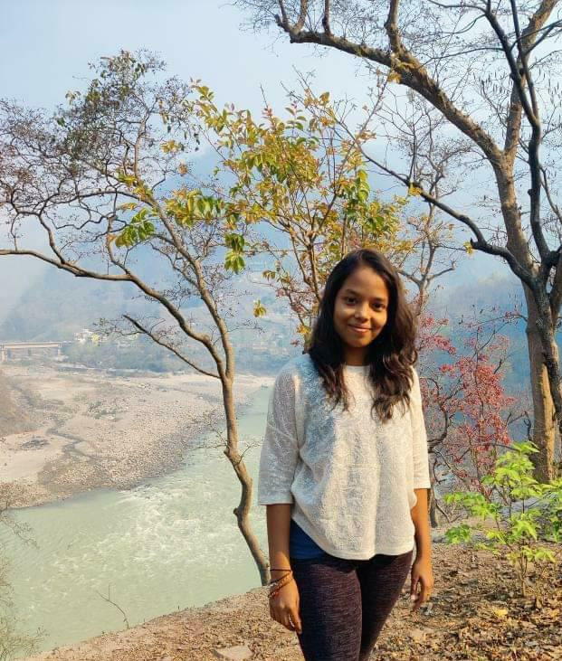

# Meghanaa Malleboina
 I have completed my undergraduation in 2021 in the stream of Civil Engineering.I have learnt C programming in my first semester which boosted me to choose Cyber Security as elective in third year. With growing interest and more advancements in the field, I wish to learn Computer Science as a full time course.
 
 